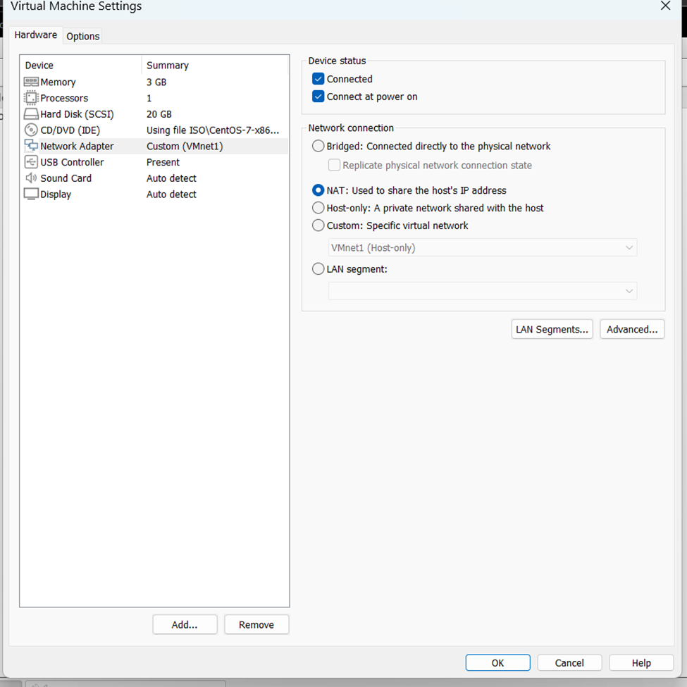

# Cấu hình DNS trên CentOS với Autoscript    

## Trước khi dùng lệnh yum để cài gói bất ki cần chỉnh


## Cài đặt và cấu hình

### Mở terminal, chuyển sang root user bằng lệnh:    
`su root` và nhập mật khẩu đã tạo tương ứng cho root    

### Sửa lỗi nguồn download của centos và cài đặt gói bind bằng lệnh:        
```
sed -i -e "/^mirrorlist/d;/^#baseurl=/{s,^#,,;s,/mirror,/vault,;}" /etc/yum.repos.d/CentOS*.repo    

yum update -y && yum install bind bind-utils -y
```
### Tải script về máy bằng lệnh:    
```
curl -LO  https://raw.githubusercontent.com/NaW5/autoscript_dns_centos/refs/heads/main/autoscript.sh
```
### Sau khi tải về ta cấp quyền thực thi cho script bằng lệnh:
```
chmod +x autoscript.sh
```

## Thực thi    
### Chạy file và cấu hình theo prompt.
```
./autoscript.sh
```
> ### Trước khi cấu hình backup trên primary server ta làm các bước trên tương tự ở backup server và cấu hình IP tĩnh trên backup server trước. Sau đó ta quay về primary server cấu hình tiếp tục.

# Note
### Khi gặp lỗi hoặc muốn khôi phục cài đặt DNS về mặc định ta chạy lệnh:
```
curl -sSL https://raw.githubusercontent.com/NaW5/autoscript_dns_centos/refs/heads/main/recovery.sh | bash
```